### START HERE!

Welcome to the Shiny RCI Calculator! 

The Shiny RCI Calculator is an interactive online application for calculating the statistical significance between an individual’s pre- and post-test score change using the Reliable Change Index (RCI). The RCI Calculator estimates an individual’s pre-post score change with either Classical Test Theory (CTT) or Item Response Theory (IRT). Users can select from different estimation methods based on their needs.

Below is a quick walk-through of the Shiny app and the expected outputs; the "user manual" so to say. But of course, nobody actually reads the user manuals… and yet, somehow, the blender still works.
  

#### Using CTT-RCI:
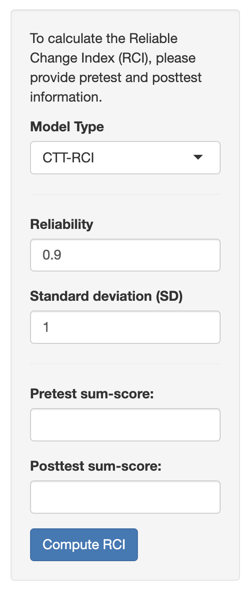

To use the CTT-based RCI, users simply input the individual’s pre-test and post-test sum scores, the reliability estimate, and the standard deviation (SD; usually taken as the pre-test SD). After pressing the “Compute RCI” button, results will appear on the right panel.  

Users can find the test measure’s SD and reliability information on either a published test measure paper, user manuals of published scales, or their own test statistics obtained from the sample data. 

The reliability estimate can be that of test-retest reliability (used by Jacobson & Truax, 1991), alpha (used by Jabrayilov et al., 2016), McDonald’s omega (used by Lee et al., 2022), or other reliability estimates one sees fit. 

Only one SD can be supplied here, which is usually taken as the pre-test SD, as that is the most accessible statistic. Note that by only using the SD of the pre-test score, one essentially assumes equal variability between the two time points. 

  

#### CTT-RCI Output:
The results include a dichotomous **“Change Status”** output of either “Did Not Reliably Change (p >= .05)” or “Reliably Changed (p < .05)”. The output further indicates the individual’s RCI value and the extent of change required for an individual to reach statistically significant change, with an alpha level of .05. 

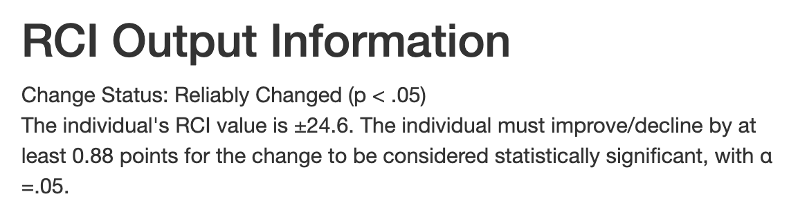  

 

The accompanying **Lookup Table** displays the RCI values based on the given reliability and SD information, showing the various pre- and post-test sum score differences and their associated P-values. 

The plot shows the individual’s pre- and post-test scores with the associated Standard Error of Measurement (SEM). If the individual’s score, represented by a black dot, falls within the blue diagonal band of the SEM, it indicates no significant change between their scores. That is, the observed score change is likely due to the measurement variability. If the individual’s dot falls **above the diagonal line**, it indicates **significant deterioration** at an alpha level of .05 (given that lower scores indicate symptom improvement). If the dot falls **below the diagonal line**, it indicates **significant improvement**.

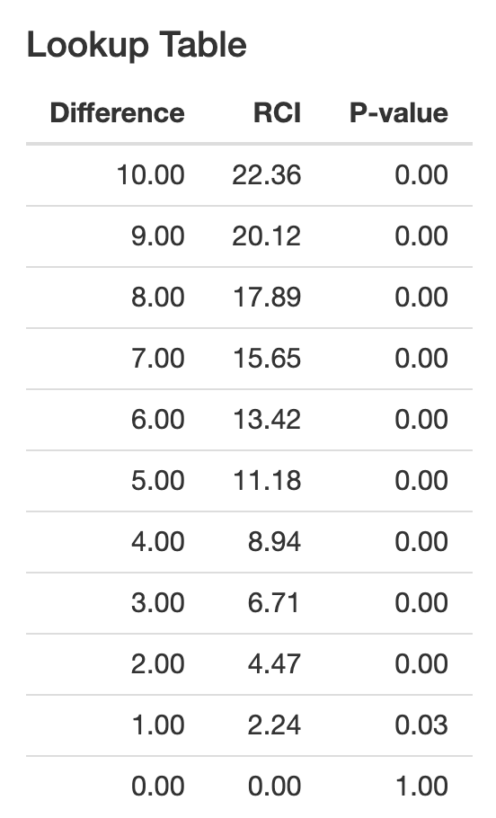

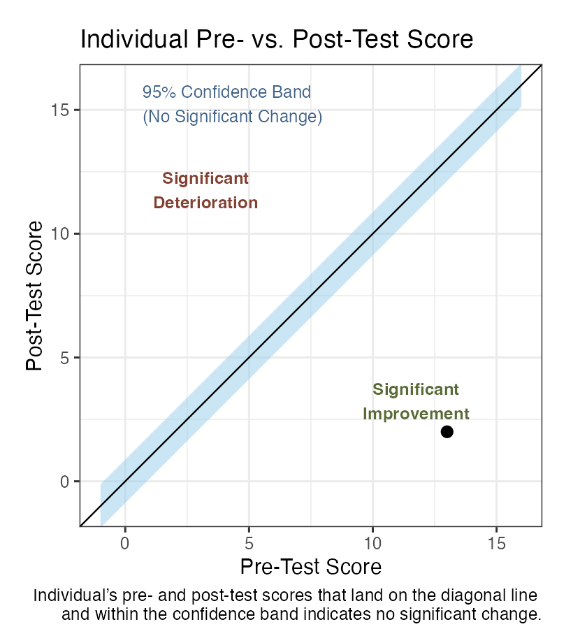

  

#### Using IRT-RCI:
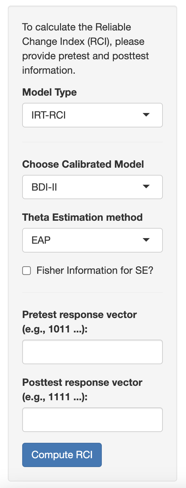

To use the IRT-based RCI, one simply selects one of the pre-calibrated models, the theta estimation method, and enters either the pre- and post-test sum scores or vector scores. After pressing the “Compute RCI” button, results will appear on the right panel. 

Currently, one can choose from 3 different pre-calibrated models for the IRT-based RCI: Beck Depression Inventory-II (BDI-II), Patient Health Questionnaire-9 (PHQ-9), and Generalized Anxiety Disorder-7 (GAD-7). A short description of the measures and where the item parameters were chosen is outlined on the right panel, which appears when a measure is selected. 

The ability to upload one’s own item response data for model calibration is still under development.

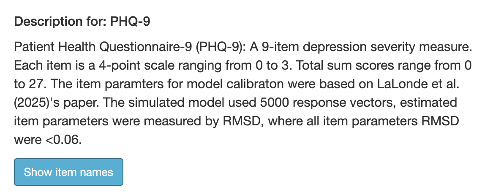

Five IRT estimation methods can be used: EAPsum, EAP, MAP, ML, or WML. The EAPsum estimation method allows sum score estimates of the individual’s latent trait when vector scores are not available. If the vector scores estimation method is chosen (i.e., EAP, MAP, ML, or WML), one can further choose to use the Fisher Information to estimate the SE or not. See the “Computation Explanation” tab for more details on the estimation methods. 

Sum scores should only be used if vector scores are not available, as IRT’s biggest advantage is being able to account for the items’ (i.e., the questions on the test) unique characteristics. Aggregating the vector scores into sum scores essentially treats all items as equal (i.e., equally able to discern people with high and low traits, equally informative, etc.), when item information is usually unequal (i.e., some items may provide a lot of information about the measured trait and others may not), which defeats the one big advantage of IRT. Hence, supplying the vector scores can utilize the most out of IRT. 

However, sometimes sum scores are the only accessible scores. In those cases, using sum scores in IRT can still be more informative than CTT, since individuals’ variability across the test range is still being accounted for. 

  

#### IRT-RCI EAPsum Output:
The results of the IRT-based RCI sum score includes a dichotomous **“Change Status”** output, the same as what is provided in the CTT-RCI. Additionally, the output summarizes the amount of change needed to be considered statistically significant.

The estimated pre- and post-test theta values, along with the associated standard errors (SE), RCI value, and P-value, are organized in a table. 

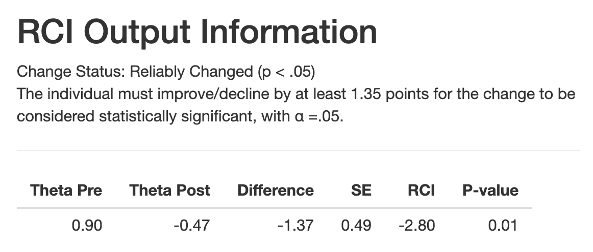

 

A **LookUp Table** is also provided, showing the estimated theta values and their associated SE values alongside the sum scores. 

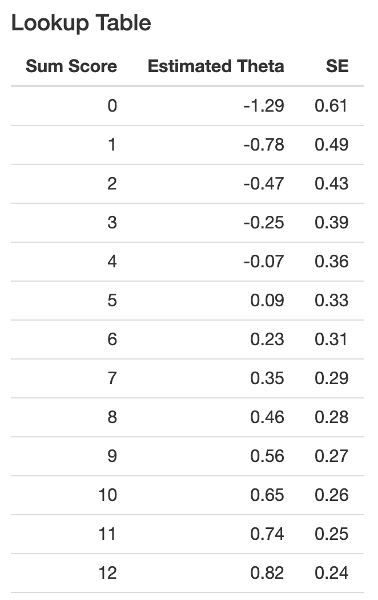
 
Furthermore, the plot shows how the IRT-RCI estimates vary across possible post-test sum scores when the pre-test sum score is held fixed at the input value. The grey band is the standard error of measurement (SEM) around the difference score. The red dot represents the observed post-test score and its change in theta. The blue dot represents the observed post-test score and its change in theta.

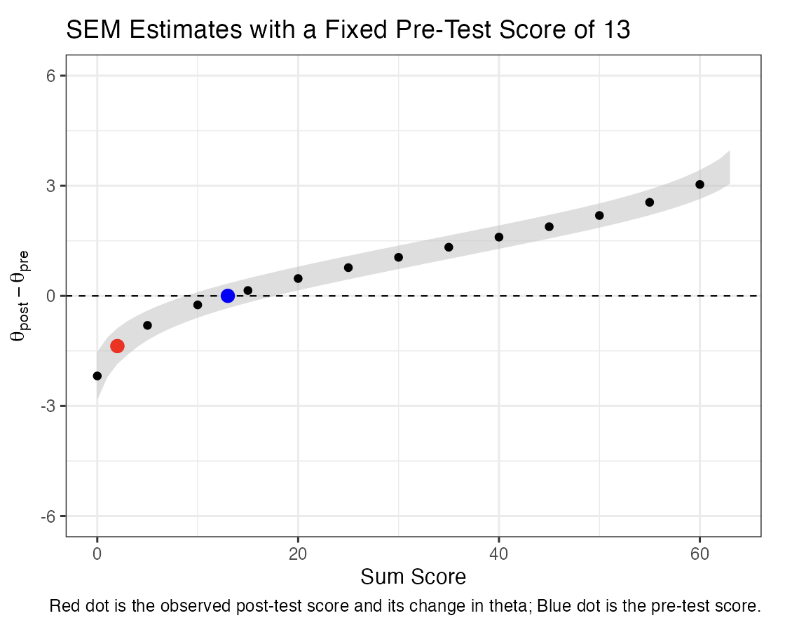

  

#### IRT-RCI Vector Scores Output:
If the vector scores do not match the required range for the IRT-based RCI vector score, a warning message will be displayed.

For example, the GAD-7 measure has 7 items, each item uses a 4-point scale ranging from 0 to 3. Therefore, the accepted input may only be a vector of length 7, consisting of values 0, 1, 2, or 3 with no spaces in between. Such as “1232012”. 

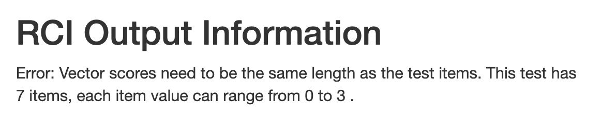

The output for the IRT-RCI vector score includes a dichotomous **“Change Status”** output, and a table containing the estimated pre-test score, estimated post-test score, difference score, associated SE, RCI value, and the P-value. 

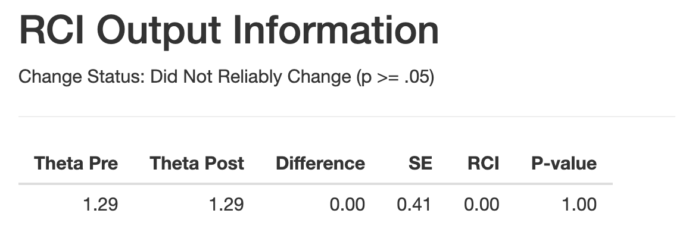

  

#### Additional Tabs across the Top:
The tabs located at the top of the Shiny app (insert screenshot) include additional information regarding the RCI computation, some background information about RCI, resources for further reading, and how to cite the app.

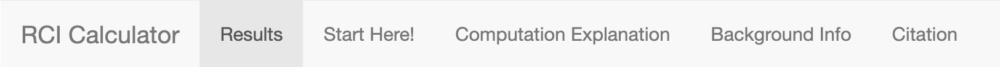
  

